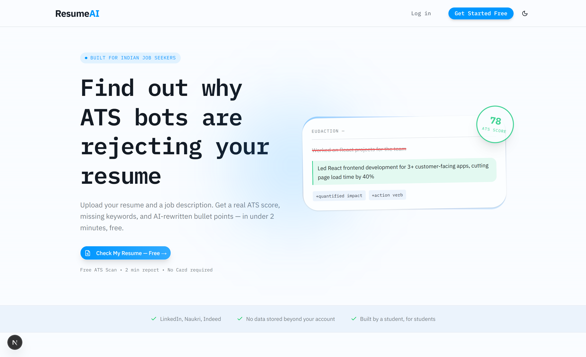
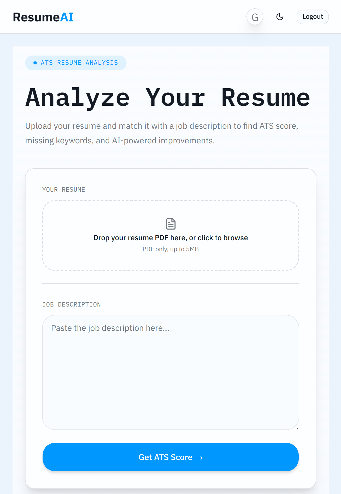
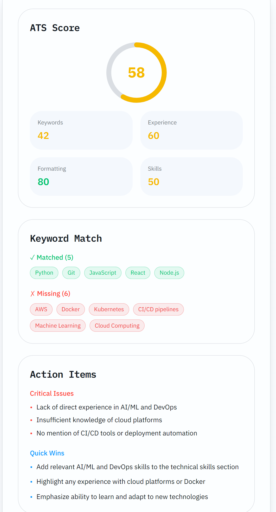

# Resume Optimizer


AI-powered resume optimizer that tailors your resume to specific job descriptions by improving ATS compatibility, keyword matching, bullet points, and overall impact.

Upload your resume, paste a job description, and get an ATS-friendly, role-specific version designed to improve readability and recruiter visibility.

[Live Demo](https://ai-resum-optimizer.vercel.app/) · [Troubleshooting](docs/troubleshooting/pdf-parse-vercel-fix.md) · [Report Bug](.github/ISSUE_TEMPLATE/bug_report.yml) · [Request Feature](.github/ISSUE_TEMPLATE/feature_request.yml)

---

## Why this project exists

Most resumes are too generic.

That leads to:

- weak ATS matching
- poorly targeted bullet points
- missed recruiter attention
- wasted time rewriting the same resume for every job

Resume Optimizer helps job seekers quickly transform one resume into multiple role-specific versions without starting from scratch.

---

## What it does

- Parses uploaded resumes
- Analyzes job descriptions
- Suggests keyword and content improvements
- Rewrites weak bullet points into stronger, impact-driven bullets
- Produces ATS-friendly resume versions
- Supports exporting and reuse across applications

---

## Screenshots

### Home

<picture>
  <source media="(prefers-color-scheme: dark)" srcset="./public/screenshots/home-dark.png">
  <source media="(prefers-color-scheme: light)" srcset="./public/screenshots/home-light.png">
  
</picture>

### Upload Resume



### Optimized Result



---

## Demo

Add a short GIF/video showing:

```
Upload Resume
      ↓
Paste Job Description
      ↓
AI Analysis
      ↓
Optimized Resume
```

Example:

```md

```

---

## How it works

1. Upload your resume
2. Paste a job description
3. Review optimization suggestions
4. Export the tailored resume
5. Reuse it for that specific application

---

## Core features

- Resume upload
- Job description parsing
- ATS-oriented optimization
- Bullet rewriting
- Keyword matching
- Before/after improvements
- Fast, simple UI
- Mobile-friendly layout

---

## Tech stack

- Next.js
- TypeScript
- React
- Tailwind CSS
- Shadcn UI
- Sonner
- PDF Parser
- AI: Groq API, Google Gemini

---

## Project structure

```bash
app/          # Routes and pages
components/   # Reusable UI components
lib/          # Utilities and services
public/       # Static assets
types/        # Shared TypeScript types
docs/         # Documentation and troubleshooting guides
```

---

## Getting started

### Prerequisites

- Node.js 18+
- npm, pnpm, or yarn

### Install

```bash
git clone https://github.com/gaur-j/resume-optimizer.git

cd resume-optimizer

npm install
```

### Environment variables

Create a `.env.local` file:

```env
NEXT_PUBLIC_APP_URL=http://localhost:3000

GROQ_API_KEY=your_groq_api_key
GEMINI_API_KEY=your_gemini_api_key

NEXT_PUBLIC_SUPABASE_URL=your_supabase_url
NEXT_PUBLIC_SUPABASE_ANON_KEY=your_supabase_anon_key
SUPABASE_SERVICE_ROLE_KEY=your_service_role_key
```

Never commit `.env.local` or expose your Supabase service role key publicly.

See the example environment file:

[.env.example](.env.example)

### Run locally

```bash
npm run dev
```

Open:

```
http://localhost:3000
```

---

## Pricing

The application is currently focused on building the core resume optimization experience.

Planned pricing features:

### Free

- Limited resume optimizations
- Basic tailoring
- Standard export

### Pro

- Unlimited optimizations
- Advanced AI rewrites
- Resume history
- Premium export options

---

# Roadmap

## Phase 1 — MVP

- [x] Resume upload
- [x] Job description input
- [x] AI optimization
- [x] Export flow

## Phase 2 — Product polish

- [ ] Resume history
- [ ] ATS scoring
- [ ] Better UI/UX
- [ ] Saved sessions

## Phase 3 — Monetization

- [ ] Free tier limits
- [ ] Pro subscription
- [ ] Payment integration
- [ ] Usage analytics

## Phase 4 — Expansion

- [ ] Cover letters
- [ ] LinkedIn optimization
- [ ] Application tracker
- [ ] Recruiter tools

---

## FAQ

### Q1. Is my resume data safe?

Your resume text is stored only for providing the requested service and is not sold or shared.

### Q2. What ATS systems does this support?

The optimizer focuses on common ATS patterns used by platforms such as Workday, Greenhouse, and other resume parsing systems.

### Q3. What file types are supported?

Currently supported:

- PDF resumes

### Q4. Does it help freshers?

Yes. It works for both freshers and experienced candidates.

### Q5. Is there a hidden subscription?

Free usage limits and future paid features will be clearly communicated. No hidden charges.

### Q6. How is this different from using ChatGPT?

Resume Optimizer combines ATS-focused analysis, keyword matching, and structured resume improvements instead of providing only a general AI response.

---

## Contributing

Contributions are welcome.

See `CONTRIBUTING.md` before opening a pull request.

---

## Security

If you find a security issue, report it privately through `SECURITY.md`.

---

## License

This project is licensed under the MIT License. See the [LICENSE](LICENSE) file for details.
